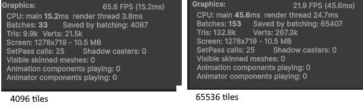

# CPU Instanced Grid Rendering – Summary

## Current Approach
The example renders a grid of quads using **Unity's `Graphics.DrawMeshInstanced`** with a list of `Matrix4x4` transforms that are recomputed every frame on the CPU.

### Pipeline
```
CPU
 ├ compute transforms (Matrix4x4 per instance)
 ├ upload matrices to GPU
 └ DrawMeshInstanced

GPU
 └ render instances
```

---

# Pros

### 1. Very simple architecture
Only requires:
- `Mesh`
- `Material`
- `List<Matrix4x4>`

### 2. Few draw calls
Unity batches up to **1023 instances per draw call**.

| Instances | Draw Calls |
|-----------|------------|  
| 1,024 | 2 |
| 10,000 | ~10 |
| 100,000 | ~98 |

Modern GPUs can easily handle **100–300 draw calls**, so this approach is viable for moderate instance counts.

### 3. Easy CPU control
All transforms are directly editable on CPU.

Example operations:
- wave animation
- rotations
- dynamic positioning

---

# Cons

### 1. CPU transform cost
Each frame computes:

```
gridSize² Matrix4x4
```

Example:

| Grid | Instances |
|-----|-----------|
32×32 | 1,024 |
128×128 | 16,384 |
256×256 | 65,536 |
512×512 | 262,144 |

CPU cost grows **O(N)** per frame.

---

### 2. Matrix upload bandwidth

Each matrix = **64 bytes**

Example bandwidth:

| Instances | Upload / frame |
|-----------|----------------|
10k | ~0.64 MB |
100k | ~6.4 MB |
200k | ~12.8 MB |

At **60 FPS**:

```
100k instances → ~384 MB/s
```

Not catastrophic, but unnecessary work.

---

### 3. 1023 instance limit per draw call

Unity splits automatically, but internally uses:

```
unity_ObjectToWorld[1023]
```

which forces batching.

---

# Performance Envelope

| Instances | Status |
|-----------|--------|
<10k | trivial |
10k–50k | still fine |
100k+ | CPU begins to dominate |
500k+ | unsuitable |


